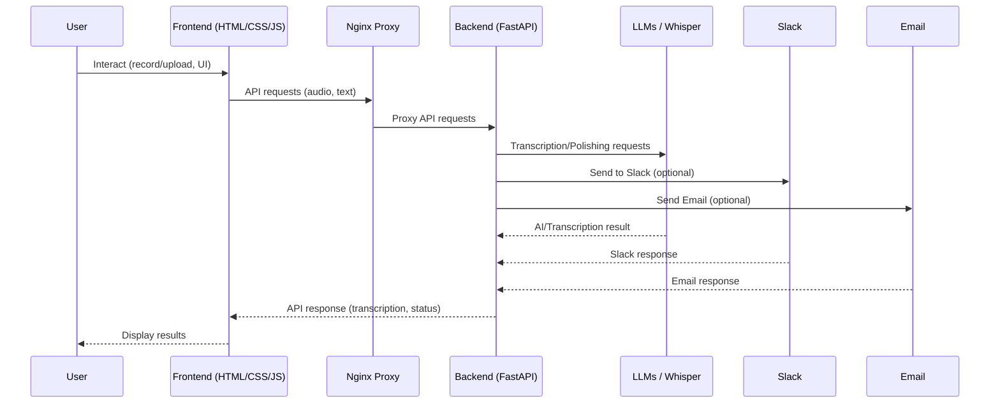

# Dictation AI

A full-stack web application for capturing, transcribing, refining, and sharing audio notes using advanced AI models. Users can record or upload audio, transcribe it to text, polish with LLMs, and send results to Slack or email. Designed for privacy, flexibility, and productivity.

Developed by **Benjamin Rebello**.

---

## Table of Contents
- [Features](#features)
- [Architecture](#architecture)
- [Tech Stack](#tech-stack)
- [Installation](#installation)
  - [Production (Docker + Traefik)](#production-docker--traefik)
  - [Local Development](#local-development)
- [Configuration](#configuration)
  - [Environment Variables](#environment-variables)
  - [Integrations](#integrations)
- [Usage](#usage)
- [Frontend UI & Theming](#frontend-ui--theming)
- [Contributing](#contributing)
- [License](#license)

---

## Features
- **Dual Audio Input**: Record from microphone or upload audio files (WAV, MP3, etc).
- **Flexible Transcription**: Choose between local Whisper (privacy) or OpenAI Whisper API (speed/accuracy).
- **AI-Powered Polishing**: Refine transcriptions with LLMs (OpenAI, Groq, Google Gemini, Anthropic) for professional notes.
- **Custom Context**: Enhance AI with company/project-specific context.
- **Slack Integration**: Send notes to Slack channels via webhook.
- **Email Integration**: Send formatted notes as HTML emails via SMTP.
- **Privacy & Security**: Credentials/API keys are never stored server-side.
- **Modern UI**: Responsive, accessible, with FontAwesome icons and dark/light mode.

---

## Architecture



```
[User] ⇄ [Frontend (HTML/CSS/JS)] ⇄ [Nginx Proxy] ⇄ [Backend (FastAPI)] ⇄ [LLMs, Whisper, Slack, Email]
```
- **Frontend**: Single-page app with vanilla JS, FontAwesome icons, responsive design, and animated controls.
- **Backend**: FastAPI serves REST endpoints for audio upload, transcription, AI-polishing, and integrations.
- **Deployment**: Dockerized for easy production use; supports Traefik reverse proxy.

---

## Tech Stack
- **Backend**: Python, FastAPI, OpenAI Whisper, SMTP, Groq, Google Gemini, Anthropic
- **Frontend**: HTML, CSS, JavaScript, FontAwesome
- **Containerization**: Docker, Docker Compose
- **Reverse Proxy**: Nginx (frontend), Traefik (production)

---

## Installation

### Production (Docker + Traefik)
#### Prerequisites
- Docker & Docker Compose installed
- Traefik running and joined to a Docker network (e.g. `servidor`)
- Domain name pointing to your server

#### Project Structure
```
dictation_AI/
├── backend/
│   ├── main.py
│   ├── requirements.txt
│   ├── Dockerfile
├── frontend/
│   ├── index.html
│   ├── main.js
│   ├── style.css
│   ├── nginx.conf
│   ├── Dockerfile
├── README.md
├── docker-compose.yml
```

#### Steps
1. **Clone the repository**
2. **Edit `docker-compose.yml`**: Set your domain, Traefik labels, and network.
3. **Configure environment variables** (see below).
4. **Upload container in ghcr.io**: 
4.1 ***Access your repo with terminal***: use a command
 ```bash
  docker login ghcr.io -u YOUR_USER_GITHUB
  ```
4.2 ***Access your repo with terminal***: create and send images of back and front:
  ```bash
  docker build -t ghcr.io/youruser/dictation-backend:latest ./backend

  docker push ghcr.io/youruser/dictation-backend:latest

  docker build -t ghcr.io/benrebello/dictation-frontend:latest ./frontend

  docker push ghcr.io/benrebello/dictation-frontend:latest
 ```

5.  **Deploy on yout server**: use a docker-compose.yml and rename images
6. **Access the app at** `https://dictation.your-domain.com`

### Local Development
#### Prerequisites
- Python 3.10+
- Node.js (optional, for frontend tooling)

#### Steps
1. **Backend**:
   ```bash
   cd backend
   python -m venv venv
   source venv/bin/activate
   pip install -r requirements.txt
   uvicorn main:app --reload
   ```
2. **Frontend**:
   - Open `frontend/index.html` in your browser, or serve with a simple HTTP server:
   ```bash
   cd frontend
   python3 -m http.server 8080
   ```
3. **Connect frontend to backend**: Ensure API endpoints in `main.js` use the correct backend URL.

---

## Configuration

### Environment Variables
Set these variables in your environment or Docker Compose file:

| Variable                | Description                        |
|-------------------------|------------------------------------|
| `OPENAI_API_KEY`        | OpenAI Whisper/LLM API key         |
| `GROQ_API_KEY`          | Groq LLM API key (optional)        |
| `GEMINI_API_KEY`        | Google Gemini API key (optional)   |
| `SLACK_WEBHOOK_URL`     | Slack Incoming Webhook URL         |
| `SMTP_HOST`             | SMTP server hostname               |
| `SMTP_PORT`             | SMTP server port                   |
| `SMTP_USER`             | SMTP username                      |
| `SMTP_PASS`             | SMTP password                      |
| `EMAIL_FROM`            | Sender email address               |
| `EMAIL_TO`              | Recipient email address            |

### Integrations
- **Slack**: Create an Incoming Webhook, set `SLACK_WEBHOOK_URL`.
- **Email**: Use SMTP credentials for your provider (Gmail, Outlook, etc).
- **LLMs**: Set API keys for OpenAI, Groq, Google Gemini, or Anthropic as needed.

---

## Usage
1. **Open the app** in your browser.
2. **Choose input**: Record audio or upload a file.
3. **Select transcription engine**: Local Whisper or OpenAI API.
4. **Transcribe**: The audio is converted to text.
5. **Polish**: Use an AI model to rephrase, summarize, or format the text.
6. **Send**: Share the final result to Slack or via email.

---

## Frontend UI & Theming
- **Icons**: Uses FontAwesome for all interface icons (microphone, upload, Slack, email, settings, theme toggle, etc).
- **Button Design**: Circular action buttons (48x48px), main record button (72x72px) with pulse animation.
- **Theming**: Supports dark/light mode via CSS custom properties. Toggle theme with sun/moon icons.
- **Responsiveness**: Layout and icons adapt for desktop and mobile.
- **Accessibility**: High-contrast color scheme, keyboard navigation, ARIA labels.

---

## Contributing
1. Fork the repository
2. Create a feature branch (`git checkout -b feature/my-feature`)
3. Commit your changes
4. Open a pull request with a clear description

**Guidelines:**
- Write clear, concise commit messages
- Document new features in the README
- Ensure code is linted and tested

---

## License
MIT License. See [LICENSE](LICENSE) for details.

---

## Credits
- [OpenAI Whisper](https://github.com/openai/whisper)
- [FontAwesome](https://fontawesome.com/)
- [FastAPI](https://fastapi.tiangolo.com/)
- [Groq](https://groq.com/)
- [Google Gemini](https://gemini.google.com/)
- [Anthropic](https://www.anthropic.com/)

---


Use this method for testing and development on your local machine without Traefik.

### 1\. Prerequisites

  - Python 3.8+
  - `ffmpeg`: Required for local transcription.
      - **macOS**: `brew install ffmpeg`
      - **Linux/Ubuntu**: `sudo apt update && sudo apt install ffmpeg`
      - **Windows**: Download from the official website and add the `bin` folder to your system's PATH.

### 2\. Backend Setup

```bash
# Navigate to the backend directory
cd backend

# Create and activate a virtual environment
python -m venv venv
source venv/bin/activate  # (or .\venv\Scripts\activate on Windows)

# Install dependencies
pip install -r requirements.txt

# Run the FastAPI server
uvicorn main:app --reload
```

The backend API will now be running at `http://localhost:8000`.

### 3\. Frontend Setup

1.  **Modify `index.html` for local use**: Temporarily change all `fetch` URLs from `/api/` back to `http://localhost:8000/`.
      - **Example**: Change `fetch("/api/transcribe", ...)` to `fetch("http://localhost:8000/transcribe", ...)`.
2.  Open the `frontend/index.html` file directly in your web browser.

## API Endpoints

The backend provides the following endpoints, which are proxied through `/api/` in the production setup.

  - `POST /transcribe`: Transcribes an audio file into raw text.
  - `POST /polish`: Refines and formats raw text using a selected LLM provider.
  - `POST /integrations/slack`: Sends the polished note to a Slack webhook.
  - `POST /integrations/email`: Sends the polished note as an HTML email via SMTP.