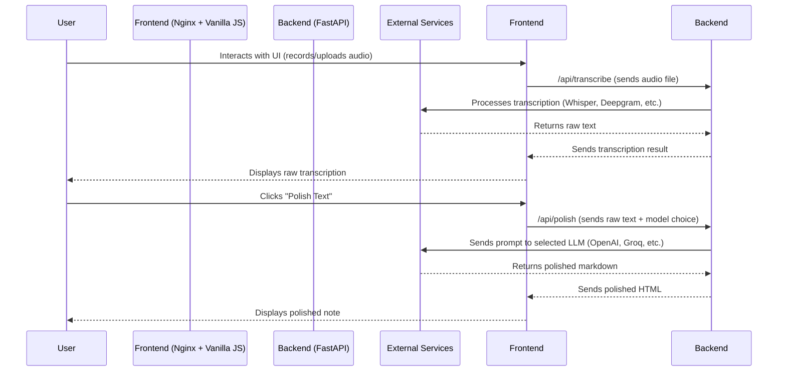

# Dictation AI

A full-stack web application for capturing, transcribing, refining, and sharing audio notes using advanced AI models. Users can record or upload audio, transcribe it to text, polish with LLMs, and send results to Slack or email. Designed for privacy, flexibility, and productivity.

Developed by **Benjamin Rebello**.

-----

## Features

  - **Dual Audio Input**: Record from the microphone or upload existing audio files.
  - **Flexible Transcription**: Choose between three powerful engines:
      - **Local Whisper** for maximum privacy.
      - **OpenAI Whisper API** for high accuracy.
      - **Deepgram** for industry-leading speed.
  - **AI-Powered Polishing**: Refine transcriptions with a wide selection of LLMs (OpenAI, Groq, Google Gemini, Anthropic) for professional notes.
  - **Custom Context**: Enhance AI accuracy with company/project-specific jargon and details.
  - **Seamless Integrations**: Send polished notes directly to Slack channels via webhook or as formatted HTML emails via SMTP.
  - **Secure by Design**: Credentials and API keys are handled per-request and are never stored on the server.
  - **Modern UI**: A responsive and intuitive interface with a dark/light mode toggle.

-----

## Architecture

The application follows a modern client-server architecture, fully containerized for robust deployment.



  - **Frontend**: A lightweight single-page application built with vanilla HTML, CSS, and JavaScript, served by Nginx. The Nginx server also acts as an internal reverse proxy, directing API calls to the backend.
  - **Backend**: A high-performance, stateless API built with Python and FastAPI. It handles all business logic, including audio processing and communication with external AI services.

-----

## Tech Stack

  - **Backend**: Python, FastAPI, OpenAI Whisper, Deepgram, Groq, Google Gemini, Anthropic
  - **Frontend**: HTML, CSS, JavaScript, FontAwesome
  - **Containerization**: Docker, Docker Compose
  - **Reverse Proxy**: Nginx (internal), Traefik (production)

-----

## Installation (Production with Docker + Traefik)

#### Prerequisites

  - Docker & Docker Compose installed.
  - Traefik running and connected to a Docker network (e.g., `servidor`).
  - A domain name pointing to your server's IP address.
  - A private container registry (e.g., GitHub Container Registry - `ghcr.io`).

#### 1\. Project Structure

Ensure your project is organized as follows:

```
dictation_AI/
├── backend/
│   ├── main.py
│   ├── requirements.txt
│   └── Dockerfile
├── frontend/
│   ├── index.html
│   ├── main.js
│   ├── style.css
│   ├── nginx.conf
│   └── Dockerfile
├── docker-compose.yml
└── README.md
```

#### 2\. Build and Push Images

Before deploying, you must build the images and push them to your container registry.

1.  **Login to your registry**:

    ```bash
    docker login ghcr.io -u YOUR_GITHUB_USERNAME
    ```

    *(Use a Personal Access Token with `write:packages` scope as the password)*

2.  **Build and push the backend image**:

    ```bash
    docker build -t ghcr.io/YOUR_GITHUB_USERNAME/dictation-backend:latest ./backend
    docker push ghcr.io/YOUR_GITHUB_USERNAME/dictation-backend:latest
    ```

3.  **Build and push the frontend image**:

    ```bash
    docker build -t ghcr.io/YOUR_GITHUB_USERNAME/dictation-frontend:latest ./frontend
    docker push ghcr.io/YOUR_GITHUB_USERNAME/dictation-frontend:latest
    ```

#### 3\. Deploy the Stack

1.  **Edit `docker-compose.yml`**:
      - Update the `image:` directives to point to your container registry paths.
      - Change the `Host(\`dictation.yourdomain.com\`)\` label to your actual domain.
2.  **Deploy using Portainer or the command line**:
      - In Portainer, create a new "Stack" and paste the content of your `docker-compose.yml`.
      - Alternatively, run `docker stack deploy -c docker-compose.yml dictation-ai` from your terminal.

-----

## Local Development

1.  **Backend**:
    ```bash
    cd backend
    python -m venv venv
    source venv/bin/activate  # On Windows: .\venv\Scripts\activate
    pip install -r requirements.txt
    uvicorn main:app --reload
    ```
2.  **Frontend**:
      - **Important**: In `frontend/main.js`, ensure the API calls are pointing to `http://localhost:8000`.
      - Open `frontend/index.html` directly in your web browser.
